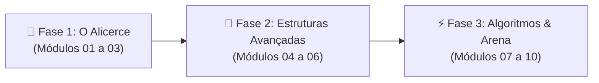

# 🧠 Do Algoritmo à Estrutura de Dados
### A Formação Definitiva em Ciência da Computação & Lógica com TypeScript

[](https://www.typescriptlang.org/)
[](https://vite.dev)
[](https://vitest.dev)
[-059669?style=for-the-badge)](#)
[](#)

> **"Não decore código. Compreenda a ciência por trás do software: como a memória aloca variáveis, como estruturas organizam dados e como algoritmos resolvem problemas em escala."**

Este projeto é uma **formação prática e visual de Ciência da Computação e Algoritmos**. Utilizando **TypeScript moderno** e **simuladores visuais em tempo real**, o curso cobre desde a arquitetura de memória e Notação Big-O até estruturas de dados avançadas (BST, Tabelas Hash) e uma Arena de Desafios no estilo LeetCode.

---

## 🧭 As Três Fases da Formação



1. **🧠 Fase 1: O Alicerce da Computação**  
   *Call Stack vs Heap na memória, ponteiros, notação Big-O, Pilhas (LIFO), Filas (FIFO) e Listas Encadeadas dinâmicas.*
2. **🌳 Fase 2: Estruturas de Dados Avançadas**  
   *Tabelas Hash com funções matemáticas e tratamento de colisões em O(1), Árvores Binárias de Busca (BST) e comparativo de Busca Linear vs Binária.*
3. **⚡ Fase 3: Algoritmos, Paradigmas & Arena de Desafios**  
   *Ordenação visual (Bubble, Selection, Merge e Quick Sort), Programação Funcional vs POO e a Arena de Desafios no estilo LeetCode com runner de testes.*

---

## 📚 Grade Curricular dos 10 Módulos

| Módulo | Tema | Destaques Práticos Implementados |
| :--- | :--- | :--- |
| **01** | **Memória & Complexidade Big-O** | Simulador gráfico de Call Stack vs Heap, frames de função, alocação dinâmica e calculadora comparativa de Big-O. |
| **02** | **Pilhas (LIFO) & Filas (FIFO)** | Laboratório interativo de Push, Pop, Enqueue e Dequeue com representação visual em tempo real. |
| **03** | **Listas Encadeadas (Linked Lists)** | Simulador gráfico de nós com ponteiros `next`, HEAD e inserção/remoção no início e no fim. |
| **04** | **Tabelas Hash & Mapas** | Visualizador de 8 Buckets de memória, cálculo de hash ASCII em tempo real e resolução de colisões. |
| **05** | **Árvores Binárias de Busca (BST)** | Árvore binária visual com nós pai/filho, percursos In-Order, Pre-Order e busca logarítmica. |
| **06** | **Algoritmos de Busca** | Comparador simultâneo lado a lado de Busca Linear O(n) vs Busca Binária O(log n). |
| **07** | **Ordenação Básica** | Simulador animado de barras coloridas com Bubble Sort e Selection Sort passo a passo. |
| **08** | **Ordenação Avançada** | Benchmark de performance em tempo real de QuickSort e MergeSort O(n log n) com milhares de números. |
| **09** | **Funcional vs POO** | Pipelines imutáveis com `filter` e `reduce` comparados com classes bancárias com encapsulamento e polimorfismo. |
| **10** | **Arena de Desafios LeetCode** | Desafios clássicos (Two Sum, Valid Parentheses, Palíndromo) com runner de testes e validações. |

---

## 🚀 Como Executar Localmente

```bash
# 1. Acesse a pasta do projeto
cd logica-programacao

# 2. Instale as dependências
npm install

# 3. Inicie o servidor de desenvolvimento
npm run dev
```

---

## 🧪 Testes Automatizados

```bash
# Executar suíte de testes com Vitest
npm test

# Modo contínuo (Watch)
npm run test:watch
```
